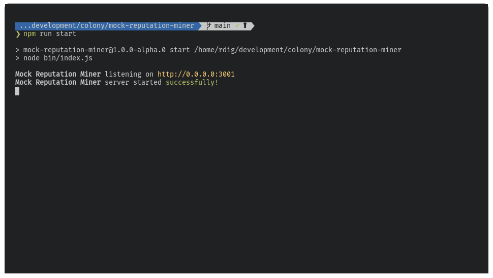
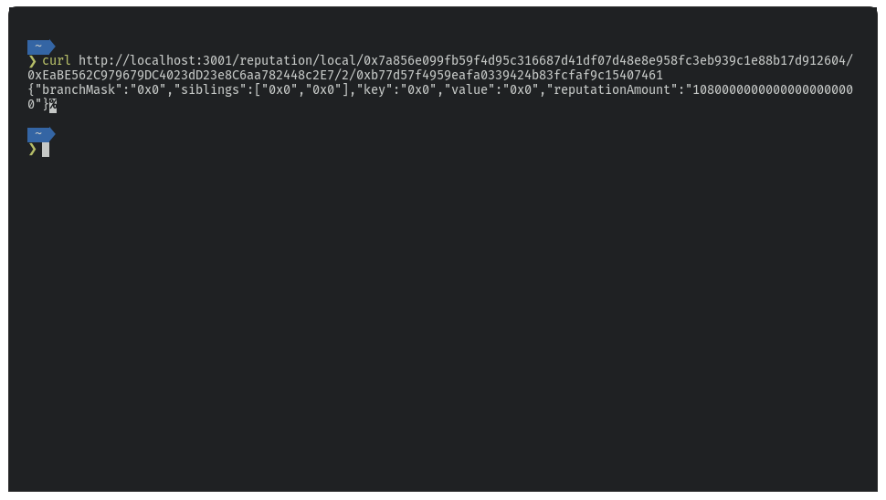
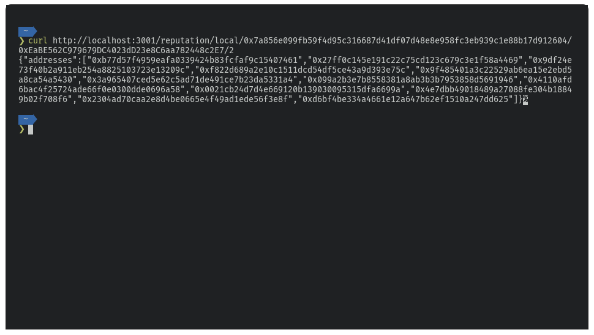

# Mock Oracle

A raw version of the [colonyNetwork](https://github.com/JoinColony/colonyNetwork)'s [reputation miner](https://github.com/JoinColony/colonyNetwork/tree/develop/packages/reputation-miner), used for local [dapp](https://github.com/JoinColony/colonyDapp) testing

A rough outline of this is working, is that it takes the available `ganache-accounts` from the file generated when `ganache` starts and mocks reputation for each one.

This is done to keep this pretty independent and not needing it to be havily integrated with either the server or the network.

So to actually use this, you **need** to use the provided ganache accounts when creating users and colonies.

### Getting started



Make sure you are using the correct `node` version:
```bash
nvm use
```

Install the required `node` modules:
```bash
npm i
```

Set up your `.env` file locally:
```bash
# The port on which the express server should run
PORT=3001

# Host address to listen on
HOST=0.0.0.0

# Path to your ganache accounts file
GANACHE_ACCOUNTS_PATH=
```

Start the server
```bash
npm start
```

### Making requests

**Fetch a user's reputation** by querying the endpoint: `/reputation/local/<rootHash>/<colonyAddress>/<domainSkillId>/<userAddress>`

_Note that for the purpouses of this mock server, `rootHash`, `colonyAddress` or `domainSkillId` are not actually checked for their validity_



**Fetch the total reputation available** in the colony by querying the endpoint: `/reputation/local/<rootHash>/<colonyAddress>/<domainSkillId>/0x0000000000000000000000000000000000000000`

_Note that for the purpouses of this mock server, `rootHash`, `colonyAddress` or `domainSkillId` are not actually checked for their validity_


**Fetch colony members sorted by reputation** by querying the endpoint: `/reputation/local/<rootHash>/<colonyAddress>/<domainSkillId>`

_Note that for the purpouses of this mock server, `rootHash`, `colonyAddress` or `domainSkillId` are not actually checked for their validity_



### Limitations

- [ ] It's not really tied to the colony, so we're mocking the reputation globally -- all colonies have the same reputation, for the same users
- [ ] We're not actually checking if the users exist. We just assume you're using ganache locally, so just the ganache accounts "have" reputation
- [ ] It's not checking `rootHash`, `colonyAddress` or `domainSkillId` for validity
- [ ] It's assuming reputation is "earned" in the native token of said colony, and the colony has a token with 18 decimals. Anything else and your conversions will most likely fail
